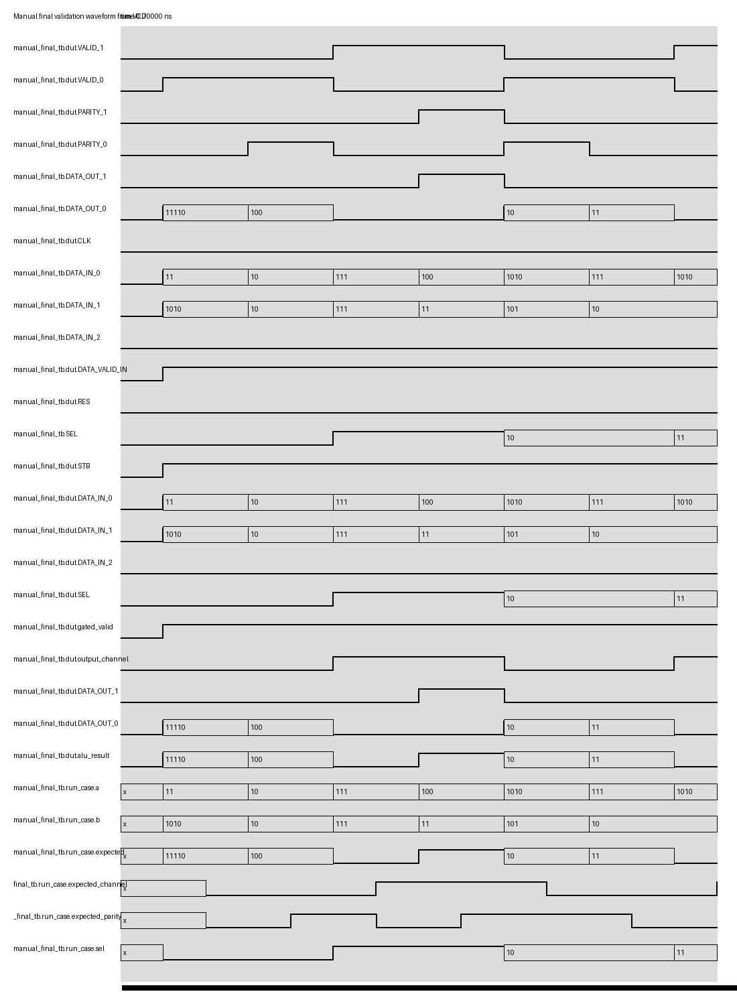

# RTL Generation Execution Report

## Input

- **Image:** `C:\Users\prana\AppData\Local\Temp\codex-clipboard-fb43a2bb-82fd-41f8-bc63-65c879fd7656.jpg`
- **Published folder:** `RTL_trial4`
- **Task:**

This image is an ALU block diagram with a selector at the input side and a DMUX
at the output side. Generate Verilog for the complete block using the notations
shown in the diagram. The ALU should perform arithmetic operations.

Manual final validation values requested by the user:

```text
Multiplication: 3x10, 2x2
Subtraction:    7-7, 4-3
Division:       10/5, 7/2
Modulus:        10%2
```

Important process correction for this revision:

```text
The user-provided values above are final validation vectors only. They are not
used in the primary/generated testbench.
```

## Model Interpretation

- **Image type:** block_diagram
- **Design name:** `alu_selective_io`
- **Design scope:** single_module
- **Confidence:** 0.95 after user clarification

### Description

The diagram shows three conceptual stages:

1. `SELECTOR`: receives `SEL[1:0]` and the input buses `DATA_IN_<0,1,2>[7:0]`, then forwards selected data to the ALU.
2. `ALU`: performs an arithmetic operation and produces `ALU_RESULT[15:0]`, `RESULT_PARITY`, and `OUTPUT_CHANNEL`.
3. `DMUX`: routes the ALU result/parity to one of two output channels: `DATA_OUT_<0,1>[15:0]`, `VALID_<0,1>`, and `PARITY_<0,1>`.

The user's clarification defines the arithmetic function. The Verilog keeps the
diagram notation in a legal Verilog form by replacing angle-bracket bus families
with numbered ports.

### Detected Blocks

- `SELECTOR`
- `ALU`
- `DMUX`

### Confirmed Interface

Inputs:

```text
CLK
RES
STB
DATA_VALID_IN
SEL[1:0]
DATA_IN_0[7:0]
DATA_IN_1[7:0]
DATA_IN_2[7:0]
```

Outputs:

```text
VALID_0
VALID_1
DATA_OUT_0[15:0]
DATA_OUT_1[15:0]
PARITY_0
PARITY_1
```

Notation mapping:

```text
DATA_IN_<0,1,2>[7:0]  -> DATA_IN_0, DATA_IN_1, DATA_IN_2
DATA_OUT_<0,1>[15:0]  -> DATA_OUT_0, DATA_OUT_1
VALID_<0,1>           -> VALID_0, VALID_1
PARITY_<0,1>          -> PARITY_0, PARITY_1
```

### Arithmetic Operation Mapping

`SEL[1:0]` is used as the ALU operation selector:

```text
SEL = 00: ALU_RESULT = DATA_IN_0 * DATA_IN_1
SEL = 01: ALU_RESULT = DATA_IN_0 - DATA_IN_1
SEL = 10: ALU_RESULT = DATA_IN_0 / DATA_IN_1
SEL = 11: ALU_RESULT = DATA_IN_0 % DATA_IN_1
```

Division and modulus by zero are guarded and produce `16'h0000`.

`DATA_IN_2` is preserved because it is present in the diagram, but it is not
used by the arithmetic operations requested for this run.

### DMUX / Output Channel Rule

```text
OUTPUT_CHANNEL = SEL[0]
SEL[0] = 0 -> route result to DATA_OUT_0, VALID_0, PARITY_0
SEL[0] = 1 -> route result to DATA_OUT_1, VALID_1, PARITY_1
```

`STB` and `DATA_VALID_IN` must both be high for either output channel to be
valid. `RES` clears routed valid/output/parity.

### Sufficiency

SUFFICIENT

The image supplied the interface and block structure. The user clarification
supplied the ALU operations and final validation cases.

## Retrieval Context

The first retrieved reference testbench was not used as an authority because it
instantiated a different module, `M65C02_ALU`, and did not match the confirmed
interface or this ALU/DMUX task.

Important correction recorded from this run:

```text
Retrieved references are guidance only. A retrieved HDL or testbench must not
be treated as authoritative unless its module/interface and behaviour match the
user's image/task.
```

## Generated Code

### final.v

```verilog
module alu_selective_io (
    input wire CLK,
    input wire RES,
    input wire STB,
    input wire DATA_VALID_IN,
    input wire [1:0] SEL,
    input wire [7:0] DATA_IN_0,
    input wire [7:0] DATA_IN_1,
    input wire [7:0] DATA_IN_2,
    output wire VALID_0,
    output wire VALID_1,
    output wire [15:0] DATA_OUT_0,
    output wire [15:0] DATA_OUT_1,
    output wire PARITY_0,
    output wire PARITY_1
);

wire gated_valid;
reg [15:0] alu_result;
wire output_channel;

assign gated_valid = (!RES) && STB && DATA_VALID_IN;
assign output_channel = SEL[0];

always @* begin
    case (SEL)
        2'b00: alu_result = DATA_IN_0 * DATA_IN_1;
        2'b01: alu_result = DATA_IN_0 - DATA_IN_1;
        2'b10: alu_result = (DATA_IN_1 == 8'd0) ? 16'h0000 : DATA_IN_0 / DATA_IN_1;
        2'b11: alu_result = (DATA_IN_1 == 8'd0) ? 16'h0000 : DATA_IN_0 % DATA_IN_1;
        default: alu_result = 16'h0000;
    endcase
end

assign VALID_0 = gated_valid && (output_channel == 1'b0);
assign VALID_1 = gated_valid && (output_channel == 1'b1);

assign DATA_OUT_0 = VALID_0 ? alu_result : 16'h0000;
assign DATA_OUT_1 = VALID_1 ? alu_result : 16'h0000;

assign PARITY_0 = VALID_0 ? ^alu_result : 1'b0;
assign PARITY_1 = VALID_1 ? ^alu_result : 1'b0;

endmodule
```

## Testbenches

### generated_tb.v

This is the primary/generated testbench. It intentionally does not use the
manual final validation values supplied by the user. It uses separate sanity and
boundary cases to check arithmetic, DMUX routing, valid gating, parity, and
inactive-channel clearing.

```verilog
`timescale 1ns/1ps

module generated_tb;
    reg CLK;
    reg RES;
    reg STB;
    reg DATA_VALID_IN;
    reg [1:0] SEL;
    reg [7:0] DATA_IN_0;
    reg [7:0] DATA_IN_1;
    reg [7:0] DATA_IN_2;

    wire VALID_0;
    wire VALID_1;
    wire [15:0] DATA_OUT_0;
    wire [15:0] DATA_OUT_1;
    wire PARITY_0;
    wire PARITY_1;

    integer errors;

    alu_selective_io dut (
        .CLK(CLK),
        .RES(RES),
        .STB(STB),
        .DATA_VALID_IN(DATA_VALID_IN),
        .SEL(SEL),
        .DATA_IN_0(DATA_IN_0),
        .DATA_IN_1(DATA_IN_1),
        .DATA_IN_2(DATA_IN_2),
        .VALID_0(VALID_0),
        .VALID_1(VALID_1),
        .DATA_OUT_0(DATA_OUT_0),
        .DATA_OUT_1(DATA_OUT_1),
        .PARITY_0(PARITY_0),
        .PARITY_1(PARITY_1)
    );

    task expect_channel;
        input [1:0] sel;
        input [7:0] a;
        input [7:0] b;
        input [15:0] expected;
        reg expected_parity;
        begin
            SEL = sel;
            DATA_IN_0 = a;
            DATA_IN_1 = b;
            DATA_IN_2 = 8'hA5;
            STB = 1'b1;
            DATA_VALID_IN = 1'b1;
            RES = 1'b0;
            #1;
            expected_parity = ^expected;
            if (sel[0] == 1'b0) begin
                if (VALID_0 !== 1'b1 || VALID_1 !== 1'b0 ||
                    DATA_OUT_0 !== expected || DATA_OUT_1 !== 16'h0000 ||
                    PARITY_0 !== expected_parity || PARITY_1 !== 1'b0) begin
                    errors = errors + 1;
                    $display("FAIL_PRIMARY sel=%b a=%0d b=%0d expected_ch0=%0d got0=%0d got1=%0d valid0=%b valid1=%b parity0=%b parity1=%b",
                             sel, a, b, expected, DATA_OUT_0, DATA_OUT_1,
                             VALID_0, VALID_1, PARITY_0, PARITY_1);
                end else begin
                    $display("PASS_PRIMARY sel=%b a=%0d b=%0d result=%0d channel=0", sel, a, b, expected);
                end
            end else begin
                if (VALID_0 !== 1'b0 || VALID_1 !== 1'b1 ||
                    DATA_OUT_0 !== 16'h0000 || DATA_OUT_1 !== expected ||
                    PARITY_0 !== 1'b0 || PARITY_1 !== expected_parity) begin
                    errors = errors + 1;
                    $display("FAIL_PRIMARY sel=%b a=%0d b=%0d expected_ch1=%0d got0=%0d got1=%0d valid0=%b valid1=%b parity0=%b parity1=%b",
                             sel, a, b, expected, DATA_OUT_0, DATA_OUT_1,
                             VALID_0, VALID_1, PARITY_0, PARITY_1);
                end else begin
                    $display("PASS_PRIMARY sel=%b a=%0d b=%0d result=%0d channel=1", sel, a, b, expected);
                end
            end
        end
    endtask

    task expect_inactive_when_not_valid;
        begin
            RES = 1'b0;
            STB = 1'b0;
            DATA_VALID_IN = 1'b1;
            SEL = 2'b00;
            DATA_IN_0 = 8'd9;
            DATA_IN_1 = 8'd9;
            DATA_IN_2 = 8'hA5;
            #1;
            if (VALID_0 !== 1'b0 || VALID_1 !== 1'b0 ||
                DATA_OUT_0 !== 16'h0000 || DATA_OUT_1 !== 16'h0000 ||
                PARITY_0 !== 1'b0 || PARITY_1 !== 1'b0) begin
                errors = errors + 1;
                $display("FAIL_PRIMARY inactive gate did not clear outputs");
            end else begin
                $display("PASS_PRIMARY inactive gate clears outputs");
            end
        end
    endtask

    initial begin
        CLK = 1'b0;
        RES = 1'b0;
        STB = 1'b0;
        DATA_VALID_IN = 1'b0;
        SEL = 2'b00;
        DATA_IN_0 = 8'h00;
        DATA_IN_1 = 8'h00;
        DATA_IN_2 = 8'h00;
        errors = 0;

        expect_channel(2'b00, 8'd6,  8'd3,  16'd18);
        expect_channel(2'b00, 8'd5,  8'd5,  16'd25);
        expect_channel(2'b01, 8'd9,  8'd2,  16'd7);
        expect_channel(2'b01, 8'd8,  8'd6,  16'd2);
        expect_channel(2'b10, 8'd12, 8'd3,  16'd4);
        expect_channel(2'b10, 8'd9,  8'd4,  16'd2);
        expect_channel(2'b11, 8'd13, 8'd5,  16'd3);
        expect_channel(2'b10, 8'd7,  8'd0,  16'd0);
        expect_inactive_when_not_valid();

        if (errors == 0) $display("PASS");
        else $display("FAIL: %0d primary testbench error(s)", errors);
        $finish;
    end
endmodule
```

### Generated Testbench Explanation

The primary testbench checks:

- multiplication, subtraction, division, and modulus with generated values;
- division by zero guard behaviour;
- channel routing from `SEL[0]`;
- valid gating from `STB && DATA_VALID_IN && !RES`;
- inactive output channel clearing;
- parity as reduction XOR of the 16-bit ALU result.

Primary testbench cases, separate from user final validation:

```text
6*3  = 18
5*5  = 25
9-2  = 7
8-6  = 2
12/3 = 4
9/4  = 2
13%5 = 3
7/0  = 0 guarded divide-by-zero case
inactive gate clearing case
```

## Verification Outcome

- **Summary:** The corrected arithmetic ALU code was compiled first, then the
  primary/generated testbench was run only after compile passed. The user's
  arithmetic values were run separately in manual final validation.
- **Compile:** PASS
- **Simulation:** PASS
- **Test bench:** `generated_tb.v`
- **Overall execution:** PASS

Verification uses Icarus Verilog: `iverilog` for compile and `vvp` for
simulation.

Additional checks:

```text
Verilator lint: PASS
Yosys synthesis/topology check: PASS
```

### Primary Testbench Output

```text
PASS_PRIMARY sel=00 a=6 b=3 result=18 channel=0
PASS_PRIMARY sel=00 a=5 b=5 result=25 channel=0
PASS_PRIMARY sel=01 a=9 b=2 result=7 channel=1
PASS_PRIMARY sel=01 a=8 b=6 result=2 channel=1
PASS_PRIMARY sel=10 a=12 b=3 result=4 channel=0
PASS_PRIMARY sel=10 a=9 b=4 result=2 channel=0
PASS_PRIMARY sel=11 a=13 b=5 result=3 channel=1
PASS_PRIMARY sel=10 a=7 b=0 result=0 channel=0
PASS_PRIMARY inactive gate clears outputs
PASS
C:\Users\prana\Documents\Claude Code\CHIPFORGE\Code Generator Model\runs_workdir\RTL_trial4\testbenches\generated_tb.v:125: $finish called at 9000 (1ps)
```

### Manual Final Validation

The following user-provided arithmetic operations were run as a separate final
validation using Icarus Verilog. These values were not used in the primary
/generated testbench and were not used to change the generated interface.

```text
VCD info: dumpfile manual_final.vcd opened for output.
PASS sel=00 DATA_IN_0=3 DATA_IN_1=10 expected=30 observed=30 channel=0 parity=0
PASS sel=00 DATA_IN_0=2 DATA_IN_1=2 expected=4 observed=4 channel=0 parity=1
PASS sel=01 DATA_IN_0=7 DATA_IN_1=7 expected=0 observed=0 channel=1 parity=0
PASS sel=01 DATA_IN_0=4 DATA_IN_1=3 expected=1 observed=1 channel=1 parity=1
PASS sel=10 DATA_IN_0=10 DATA_IN_1=5 expected=2 observed=2 channel=0 parity=1
PASS sel=10 DATA_IN_0=7 DATA_IN_1=2 expected=3 observed=3 channel=0 parity=0
PASS sel=11 DATA_IN_0=10 DATA_IN_1=2 expected=0 observed=0 channel=1 parity=0
OVERALL PASS
manual_final_tb.v:111: $finish called at 75000 (1ps)
```

### Result Interpretation

For each manual operation:

```text
observed = selected DATA_OUT channel
parity   = reduction XOR of the 16-bit ALU result
channel  = SEL[0]
```

The inactive output channel remains zero and invalid for each test case.

### Simulation Image



## Diagnostics

# Diagnostics

## Attempt 1

The first attempt failed for two separate reasons:

- an unrelated retrieved reference testbench instantiated `M65C02_ALU`, which
  did not match the requested `alu_selective_io` module;
- the generated RTL lost the confirmed bus widths and treated `SEL`,
  `DATA_IN_0`, `DATA_IN_1`, `DATA_IN_2`, `DATA_OUT_0`, and `DATA_OUT_1` as
  scalar 1-bit signals.

That attempt was not accepted as the final result.

## Attempt 2

The second published version was legible, but it still reused the user's manual
final validation values in the primary testbench. That was incorrect because
manual vectors must remain a separate final validation stage.

## Attempt 3

The corrected revision keeps the primary/generated testbench separate from the
manual final validation. The ALU RTL compiles standalone first, the generated
primary testbench passes with separate cases, and the user's values pass only in
manual final validation.

## Feedback Rules Added

Retrieved references are not automatically authoritative. A reference must match
the user's module/interface and behaviour before it can be used as an active
verification source.

Manual final validation values supplied by the user must not be reused as the
primary/generated testbench cases.
