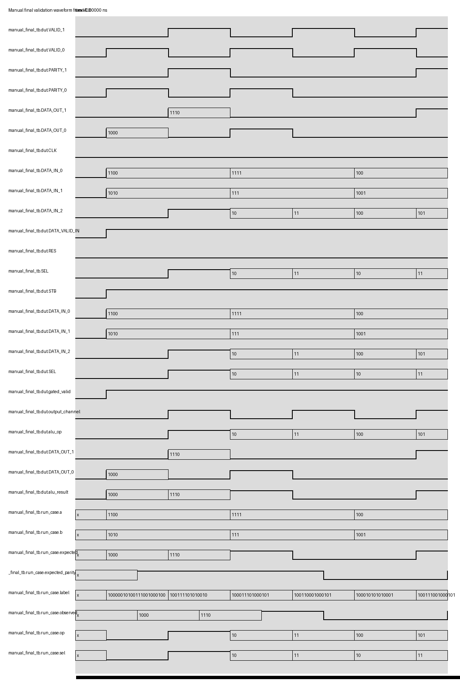

# RTL Generation Execution Report

## Input

- **Image:** `C:\Users\prana\AppData\Local\Temp\codex-clipboard-7ab04d3e-d17a-4e5d-a4ff-431330e0127c.jpg`
- **Published folder:** `RTL_trial5`
- **Task:**

Write Verilog code to execute logical and relational operations on the ALU shown in the block diagram.

Manual final validation values supplied by the user:

```text
Logical:
12 AND 10
12 OR 10

Relational:
15 >= 7
15 <= 7
4 == 9
4 != 9
```

The user-provided values above were used only in the separate manual final validation stage, not in the primary/generated testbench.

## Model Interpretation

- **Image type:** block_diagram
- **Design name:** `alu_selective_io_logic_rel`
- **Design scope:** single_module
- **Confidence:** 0.95 after user clarification

### Description

The diagram shows a selector feeding an ALU, followed by a DMUX that routes the ALU result, result parity, and valid flag to one of two output channels.

The diagram provides `SEL[1:0]` and `DATA_IN_<0,1,2>[7:0]`. To support both logical and relational operations requested by the user, this run uses `DATA_IN_2[2:0]` as the ALU operation code and keeps `SEL[0]` as the DMUX output-channel selector.

### Confirmed Interface

Inputs:

```text
CLK
RES
STB
DATA_VALID_IN
SEL[1:0]
DATA_IN_0[7:0]
DATA_IN_1[7:0]
DATA_IN_2[7:0]
```

Outputs:

```text
VALID_0
VALID_1
DATA_OUT_0[15:0]
DATA_OUT_1[15:0]
PARITY_0
PARITY_1
```

Notation mapping:

```text
DATA_IN_<0,1,2>[7:0]  -> DATA_IN_0, DATA_IN_1, DATA_IN_2
DATA_OUT_<0,1>[15:0]  -> DATA_OUT_0, DATA_OUT_1
VALID_<0,1>           -> VALID_0, VALID_1
PARITY_<0,1>          -> PARITY_0, PARITY_1
```

### Operation Mapping

```text
DATA_IN_2[2:0] = 000: logical bitwise AND, DATA_IN_0 & DATA_IN_1
DATA_IN_2[2:0] = 001: logical bitwise OR,  DATA_IN_0 | DATA_IN_1
DATA_IN_2[2:0] = 010: relational greater-than-or-equal, DATA_IN_0 >= DATA_IN_1
DATA_IN_2[2:0] = 011: relational less-than-or-equal,    DATA_IN_0 <= DATA_IN_1
DATA_IN_2[2:0] = 100: relational equal,                 DATA_IN_0 == DATA_IN_1
DATA_IN_2[2:0] = 101: relational not equal,             DATA_IN_0 != DATA_IN_1
```

Logical results are zero-extended to 16 bits. Relational results are encoded as `16'h0001` when true and `16'h0000` when false.

### DMUX / Output Channel Rule

```text
OUTPUT_CHANNEL = SEL[0]
SEL[0] = 0 -> DATA_OUT_0, VALID_0, PARITY_0
SEL[0] = 1 -> DATA_OUT_1, VALID_1, PARITY_1
```

`STB && DATA_VALID_IN && !RES` gates valid output. `RES` clears the routed outputs.

### Sufficiency

SUFFICIENT

The image supplied the interface and block structure. The user task and final validation cases clarified the logical/relational operation set.

## Generated Code

### final.v

```verilog
module alu_selective_io_logic_rel (
    input wire CLK,
    input wire RES,
    input wire STB,
    input wire DATA_VALID_IN,
    input wire [1:0] SEL,
    input wire [7:0] DATA_IN_0,
    input wire [7:0] DATA_IN_1,
    input wire [7:0] DATA_IN_2,
    output wire VALID_0,
    output wire VALID_1,
    output wire [15:0] DATA_OUT_0,
    output wire [15:0] DATA_OUT_1,
    output wire PARITY_0,
    output wire PARITY_1
);

wire gated_valid;
wire output_channel;
wire [2:0] alu_op;
reg [15:0] alu_result;

assign gated_valid = (!RES) && STB && DATA_VALID_IN;
assign output_channel = SEL[0];
assign alu_op = DATA_IN_2[2:0];

always @* begin
    case (alu_op)
        3'b000: alu_result = {8'h00, (DATA_IN_0 & DATA_IN_1)};
        3'b001: alu_result = {8'h00, (DATA_IN_0 | DATA_IN_1)};
        3'b010: alu_result = (DATA_IN_0 >= DATA_IN_1) ? 16'h0001 : 16'h0000;
        3'b011: alu_result = (DATA_IN_0 <= DATA_IN_1) ? 16'h0001 : 16'h0000;
        3'b100: alu_result = (DATA_IN_0 == DATA_IN_1) ? 16'h0001 : 16'h0000;
        3'b101: alu_result = (DATA_IN_0 != DATA_IN_1) ? 16'h0001 : 16'h0000;
        default: alu_result = 16'h0000;
    endcase
end

assign VALID_0 = gated_valid && (output_channel == 1'b0);
assign VALID_1 = gated_valid && (output_channel == 1'b1);

assign DATA_OUT_0 = VALID_0 ? alu_result : 16'h0000;
assign DATA_OUT_1 = VALID_1 ? alu_result : 16'h0000;

assign PARITY_0 = VALID_0 ? ^alu_result : 1'b0;
assign PARITY_1 = VALID_1 ? ^alu_result : 1'b0;

endmodule
```

## Primary Testbench

### generated_tb.v

This primary generated testbench uses separate sanity and boundary cases. It intentionally does not use the user's manual final validation values.

```verilog
`timescale 1ns/1ps

module generated_tb;
    reg CLK;
    reg RES;
    reg STB;
    reg DATA_VALID_IN;
    reg [1:0] SEL;
    reg [7:0] DATA_IN_0;
    reg [7:0] DATA_IN_1;
    reg [7:0] DATA_IN_2;

    wire VALID_0;
    wire VALID_1;
    wire [15:0] DATA_OUT_0;
    wire [15:0] DATA_OUT_1;
    wire PARITY_0;
    wire PARITY_1;

    integer errors;

    alu_selective_io_logic_rel dut (
        .CLK(CLK),
        .RES(RES),
        .STB(STB),
        .DATA_VALID_IN(DATA_VALID_IN),
        .SEL(SEL),
        .DATA_IN_0(DATA_IN_0),
        .DATA_IN_1(DATA_IN_1),
        .DATA_IN_2(DATA_IN_2),
        .VALID_0(VALID_0),
        .VALID_1(VALID_1),
        .DATA_OUT_0(DATA_OUT_0),
        .DATA_OUT_1(DATA_OUT_1),
        .PARITY_0(PARITY_0),
        .PARITY_1(PARITY_1)
    );

    task expect_channel;
        input [1:0] sel;
        input [2:0] op;
        input [7:0] a;
        input [7:0] b;
        input [15:0] expected;
        reg expected_parity;
        begin
            SEL = sel;
            DATA_IN_0 = a;
            DATA_IN_1 = b;
            DATA_IN_2 = {5'b10101, op};
            STB = 1'b1;
            DATA_VALID_IN = 1'b1;
            RES = 1'b0;
            #1;
            expected_parity = ^expected;
            if (sel[0] == 1'b0) begin
                if (VALID_0 !== 1'b1 || VALID_1 !== 1'b0 ||
                    DATA_OUT_0 !== expected || DATA_OUT_1 !== 16'h0000 ||
                    PARITY_0 !== expected_parity || PARITY_1 !== 1'b0) begin
                    errors = errors + 1;
                    $display("FAIL_PRIMARY sel=%b op=%b a=%h b=%h expected_ch0=%h got0=%h got1=%h valid0=%b valid1=%b parity0=%b parity1=%b",
                             sel, op, a, b, expected, DATA_OUT_0, DATA_OUT_1,
                             VALID_0, VALID_1, PARITY_0, PARITY_1);
                end else begin
                    $display("PASS_PRIMARY sel=%b op=%b a=%h b=%h result=%h channel=0", sel, op, a, b, expected);
                end
            end else begin
                if (VALID_0 !== 1'b0 || VALID_1 !== 1'b1 ||
                    DATA_OUT_0 !== 16'h0000 || DATA_OUT_1 !== expected ||
                    PARITY_0 !== 1'b0 || PARITY_1 !== expected_parity) begin
                    errors = errors + 1;
                    $display("FAIL_PRIMARY sel=%b op=%b a=%h b=%h expected_ch1=%h got0=%h got1=%h valid0=%b valid1=%b parity0=%b parity1=%b",
                             sel, op, a, b, expected, DATA_OUT_0, DATA_OUT_1,
                             VALID_0, VALID_1, PARITY_0, PARITY_1);
                end else begin
                    $display("PASS_PRIMARY sel=%b op=%b a=%h b=%h result=%h channel=1", sel, op, a, b, expected);
                end
            end
        end
    endtask

    task expect_cleared_by_reset;
        begin
            RES = 1'b1;
            STB = 1'b1;
            DATA_VALID_IN = 1'b1;
            SEL = 2'b01;
            DATA_IN_0 = 8'hFF;
            DATA_IN_1 = 8'h0F;
            DATA_IN_2 = 8'h5A;
            #1;
            if (VALID_0 !== 1'b0 || VALID_1 !== 1'b0 ||
                DATA_OUT_0 !== 16'h0000 || DATA_OUT_1 !== 16'h0000 ||
                PARITY_0 !== 1'b0 || PARITY_1 !== 1'b0) begin
                errors = errors + 1;
                $display("FAIL_PRIMARY reset did not clear outputs");
            end else begin
                $display("PASS_PRIMARY reset clears outputs");
            end
        end
    endtask

    task expect_inactive_without_strobe;
        begin
            RES = 1'b0;
            STB = 1'b0;
            DATA_VALID_IN = 1'b1;
            SEL = 2'b00;
            DATA_IN_0 = 8'hF0;
            DATA_IN_1 = 8'h0F;
            DATA_IN_2 = 8'h5A;
            #1;
            if (VALID_0 !== 1'b0 || VALID_1 !== 1'b0 ||
                DATA_OUT_0 !== 16'h0000 || DATA_OUT_1 !== 16'h0000 ||
                PARITY_0 !== 1'b0 || PARITY_1 !== 1'b0) begin
                errors = errors + 1;
                $display("FAIL_PRIMARY inactive strobe did not clear outputs");
            end else begin
                $display("PASS_PRIMARY inactive strobe clears outputs");
            end
        end
    endtask

    initial begin
        CLK = 1'b0;
        RES = 1'b0;
        STB = 1'b0;
        DATA_VALID_IN = 1'b0;
        SEL = 2'b00;
        DATA_IN_0 = 8'h00;
        DATA_IN_1 = 8'h00;
        DATA_IN_2 = 8'h00;
        errors = 0;

        expect_channel(2'b00, 3'b000, 8'hC3, 8'h3C, 16'h0000);
        expect_channel(2'b01, 3'b001, 8'h80, 8'h0F, 16'h008F);
        expect_channel(2'b10, 3'b010, 8'd14, 8'd6,  16'h0001);
        expect_channel(2'b11, 3'b010, 8'd5,  8'd8,  16'h0000);
        expect_channel(2'b10, 3'b011, 8'd2,  8'd9,  16'h0001);
        expect_channel(2'b11, 3'b011, 8'd12, 8'd4,  16'h0000);
        expect_channel(2'b10, 3'b100, 8'h44, 8'h44, 16'h0001);
        expect_channel(2'b11, 3'b100, 8'h24, 8'h42, 16'h0000);
        expect_channel(2'b10, 3'b101, 8'h66, 8'h77, 16'h0001);
        expect_channel(2'b11, 3'b101, 8'h99, 8'h99, 16'h0000);
        expect_cleared_by_reset();
        expect_inactive_without_strobe();

        if (errors == 0) $display("PASS");
        else $display("FAIL: %0d primary testbench error(s)", errors);
        $finish;
    end
endmodule
```

### Generated Testbench Explanation

The primary testbench checks:

- logical AND and OR;
- relational `>=`, `<=`, `==`, and `!=`;
- true and false relational outcomes;
- DMUX routing through `SEL[0]`;
- output valid gating;
- reset and inactive strobe clearing;
- parity as reduction XOR of the 16-bit ALU result.

## Verification Outcome

- **Summary:** RTL compiled standalone first, then the generated primary testbench was run only after compile passed. User values were run separately in manual final validation.
- **Compile:** PASS
- **Simulation:** PASS
- **Test bench:** `generated_tb.v`
- **Overall execution:** PASS

Verification uses Icarus Verilog: `iverilog` for compile and `vvp` for simulation.

Additional checks:

```text
Verilator lint: PASS_WITH_WARNINGS
Yosys synthesis/topology check: PASS
```

### Primary Testbench Output

```text
PASS_PRIMARY sel=00 op=000 a=c3 b=3c result=0000 channel=0
PASS_PRIMARY sel=01 op=001 a=80 b=0f result=008f channel=1
PASS_PRIMARY sel=10 op=010 a=0e b=06 result=0001 channel=0
PASS_PRIMARY sel=11 op=010 a=05 b=08 result=0000 channel=1
PASS_PRIMARY sel=10 op=011 a=02 b=09 result=0001 channel=0
PASS_PRIMARY sel=11 op=011 a=0c b=04 result=0000 channel=1
PASS_PRIMARY sel=10 op=100 a=44 b=44 result=0001 channel=0
PASS_PRIMARY sel=11 op=100 a=24 b=42 result=0000 channel=1
PASS_PRIMARY sel=10 op=101 a=66 b=77 result=0001 channel=0
PASS_PRIMARY sel=11 op=101 a=99 b=99 result=0000 channel=1
PASS_PRIMARY reset clears outputs
PASS_PRIMARY inactive strobe clears outputs
PASS
C:\Users\prana\Documents\Claude Code\CHIPFORGE\Code Generator Model\runs_workdir\RTL_trial5\testbenches\generated_tb.v:150: $finish called at 12000 (1ps)
```

### Manual Final Validation

The following user-provided logical and relational operations were run as a separate final validation using Icarus Verilog.

```text
VCD info: dumpfile manual_final.vcd opened for output.
PASS AND DATA_IN_0=12 DATA_IN_1=10 expected=8 observed=8 channel=0 parity=1
PASS OR DATA_IN_0=12 DATA_IN_1=10 expected=14 observed=14 channel=1 parity=1
PASS GE DATA_IN_0=15 DATA_IN_1=7 expected=1 observed=1 channel=0 parity=1
PASS LE DATA_IN_0=15 DATA_IN_1=7 expected=0 observed=0 channel=1 parity=0
PASS EQ DATA_IN_0=4 DATA_IN_1=9 expected=0 observed=0 channel=0 parity=0
PASS NE DATA_IN_0=4 DATA_IN_1=9 expected=1 observed=1 channel=1 parity=1
OVERALL PASS
manual_final_tb.v:100: $finish called at 65000 (1ps)
```

### Result Interpretation

For each manual operation:

```text
observed = selected DATA_OUT channel
parity   = reduction XOR of the 16-bit ALU result
channel  = SEL[0]
```

The inactive output channel remains zero and invalid for each test case.

### Simulation Image



## Diagnostics

# Diagnostics

No compile, primary simulation, or manual final validation failures were recorded.

## Feedback Rules Followed

- Manual final validation vectors were not reused in the primary/generated testbench.
- Retrieved references were not treated as authoritative unless they matched the confirmed task/interface.
- RTL was compiled before any testbench simulation was run.
