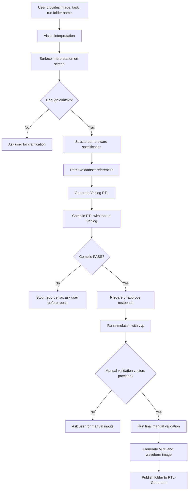
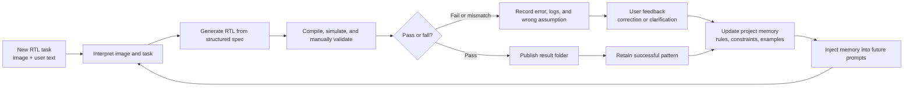
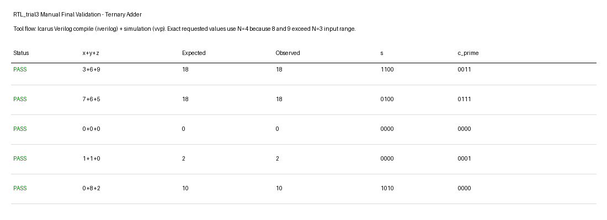
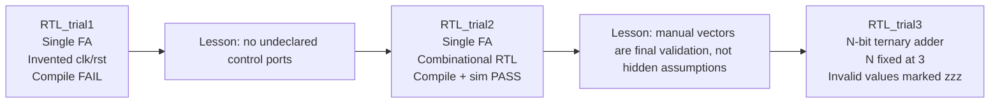

# RTL Code Generation Trial Comparison Report

This report compares the first three published RTL generation trials and records
the execution lessons that must be treated as model feedback for later runs.
The project is an RTL code-generation model, not a direct image-to-code demo.
The intended flow is: read the image and user task, describe the hardware
meaning, convert it into a structured specification, generate Verilog, compile
the Verilog, run testbench simulation, run manual final validation, and publish
the complete result folder.

## Required Flow



## Feedback Loop

The model must not treat each execution as isolated. Each run produces
evidence, and the user corrections from that evidence are converted into
pipeline memory. That memory is then injected into later interpretation and RTL
generation prompts so the same mistake is less likely to repeat.



In simple terms, the feedback loop is:

```text
execution result -> mistake or success -> user correction -> project memory ->
future interpretation/generation prompt -> improved next execution
```

For example, `RTL_trial1` taught the model not to invent `clk` or `rst` for a
combinational full adder. `RTL_trial3` taught the model not to change `N` from 3
to 4 just to make invalid manual values fit. Those are now feedback-memory
rules, not just notes in a past report.

## Trial Summary

| Trial | Requested design | Main interpretation | Compile | Simulation | Manual final validation | Overall result |
|---|---|---|---|---|---|---|
| [RTL_trial1](RTL_trial1/) | One full adder block from 3-bit ripple/ternary adder image | Correctly identified a one-bit full adder interface using image labels `x_i`, `y_i`, `z_i`, `s_i`, `c_i_prime` | FAIL | SKIPPED | Not reached | FAIL |
| [RTL_trial2](RTL_trial2/) | Same one full adder block after correction | Same interface, now treated as pure combinational logic | PASS | PASS | Manual vectors exercised in the generated flow | PASS |
| [RTL_trial3](RTL_trial3/) | Entire N-bit ternary adder block, with `N = 3` | Correctly represented the block as a parameterized carry-save ternary adder | PASS | PASS | PASS after invalid out-of-range values were marked as `zzz` | PASS |

## What Was Understood

Across all three trials, the image and task were understood at the high-level
hardware concept level:

- The figure is a ternary or 3-operand addition structure built from repeated
  full-adder style slices.
- Each slice accepts three operand bits, labelled as `x`, `y`, and `z` variants
  in the image.
- The local slice output is a sum bit `s`.
- The carry-save output is labelled using primed carry notation, such as
  `c_i_prime` in code form.
- For the whole block, the useful Verilog abstraction is parameterized by `N`,
  with vectors `[N-1:0]`.

This shows that the pipeline is moving in the correct direction: it is using
the image and the text together, then generating RTL from an interpreted
hardware specification.

## What Was Not Understood Initially

The failures were not caused by the user task being impossible. They were
caused by missing execution discipline in the pipeline:

- In `RTL_trial1`, the generated RTL invented `clk` and `rst` even though the
  requested full adder was combinational and the interface did not include
  clock or reset ports.
- The first run did not surface enough live interpretation before continuing,
  so the user could not stop a wrong assumption early.
- Manual validation vectors were initially mixed too closely with generated
  testbench logic, which made it harder to separate normal verification from
  final user-confirmed validation.
- In `RTL_trial3`, invalid manual values `8` and `9` were first handled by
  increasing the width to 4 bits. That was incorrect because the user had fixed
  `N = 3`; invalid values must be rejected or shown as unknown, not made valid
  by changing the design.

## Trial 1

`RTL_trial1` asked for only one full adder block from the diagram. The model
correctly extracted the intended port names:

```text
x_i, y_i, z_i -> s_i, c_i_prime
```

The generated logic equation was conceptually correct:

```verilog
s_i = x_i ^ y_i ^ z_i
c_i_prime = (x_i & y_i) | (y_i & z_i) | (x_i & z_i)
```

The implementation failed because it wrapped that combinational equation in a
clocked `always` block using undeclared `clk` and `rst`:

```verilog
always @(posedge clk or posedge rst)
```

Because `clk` and `rst` were not ports or internal declarations, Icarus Verilog
failed elaboration. Simulation was skipped. This trial produced an important
learning: do not invent timing or control signals from habit. The interface
must come from the image, user text, or explicit confirmation.

## Trial 2

`RTL_trial2` repeated the full adder task after applying the first lesson. The
RTL was reduced to a pure combinational module:

```verilog
module full_adder (
  input wire x_i,
  input wire y_i,
  input wire z_i,
  output wire s_i,
  output wire c_i_prime
);
```

The code compiled successfully, simulated successfully, and matched the
expected full-adder equations. This proved that the core logic was not the
problem in Trial 1; the failure was the invented sequential wrapper.

The remaining process issue in Trial 2 was reporting discipline. The user had
intended manual inputs to be a final independent check, not something buried in
the generated testbench. That became a permanent requirement:

- compile the generated RTL first
- run the normal testbench second
- require manual validation inputs before final publication
- clearly label manual validation as a separate Icarus Verilog run

## Trial 3

`RTL_trial3` expanded the scope from one full-adder slice to the entire ternary
adder block. The user requested generic `N-1` terminology and then fixed
`N = 3` for the run.

The generated RTL used a parameterized carry-save representation:

```verilog
module ternary_adder #(
    parameter N = 3
) (
  input wire [N-1:0] x,
  input wire [N-1:0] y,
  input wire [N-1:0] z,
  output wire [N-1:0] s,
  output wire [N-1:0] c_prime
);
```

The behavior is:

```verilog
assign s = x ^ y ^ z;
assign c_prime = (x & y) | (x & z) | (y & z);
```

This is a carry-save form. The arithmetic value is reconstructed as:

```text
observed_sum = s + (c_prime << 1)
```

The correction in this trial was about respecting fixed bit width. The user
provided manual operations:

```text
3+6+9
7+6+5
0+0+0
1+1+0
0+8+2
```

Because `N = 3`, legal unsigned inputs are only `0..7`. Therefore `9` and `8`
are invalid. The corrected validation result marks those cases as `zzz` instead
of silently changing the design width.

```text
INVALID 3+6+9 reason=out_of_range_for_N3 expected=zzz observed=zzz
PASS 7+6+5 expected=18 observed=18
PASS 0+0+0 expected=0 observed=0
PASS 1+1+0 expected=2 observed=2
INVALID 0+8+2 reason=out_of_range_for_N3 expected=zzz observed=zzz
OVERALL PASS valid_cases_passed invalid_cases=2
```

The published simulation evidence is here:



## Execution Differences



The technical design improved from a one-bit combinational slice to a
parameterized N-bit carry-save block. The process also improved: interpretation
became more explicit, compile status became mandatory to surface, manual input
became compulsory, and invalid manual values now test the boundary of the
specification rather than causing the design to mutate.

## Permanent Feedback For Later Runs

These points must be treated as model memory:

- Do not generate RTL directly from an image. First describe and structure the
  image/task interpretation.
- Show the interpretation on screen before generation proceeds far enough to
  waste time.
- If context is insufficient, ask the user instead of guessing.
- Do not invent ports such as `clk`, `rst`, `enable`, or `valid` unless they are
  visible in the image, present in the text, found in a trusted reference, or
  confirmed by the user.
- Compile generated RTL before running or trusting any testbench result.
- If compile fails in interactive mode, stop and report the failure before
  attempting repair.
- Manual validation inputs are compulsory before final publication.
- Manual validation is run with Icarus Verilog and must be reported separately
  from generated/reference testbench simulation.
- Respect user-confirmed parameters. If `N = 3`, do not increase `N` to make
  invalid manual inputs fit.
- Published GitHub folders should contain review evidence, not compiled `.vvp`
  files or unnecessary duplicate scratch artifacts.
- Waveform evidence should include a VCD and a PNG image. GTKWave is used for
  interactive inspection of the same VCD.

## Final Assessment

The laptop specifications did not cause the RTL logic mistake. Limited local
hardware can make Qwen inference slower or reduce model quality because smaller
models are being used, but the Trial 1 failure was a generation/interface error:
the RTL referenced undeclared `clk` and `rst`. The Trial 3 correction was also
not hardware-related; it was a specification discipline issue. The correct fix
is stronger pipeline memory, visible checkpoints, compile-first verification,
and compulsory manual final validation.
